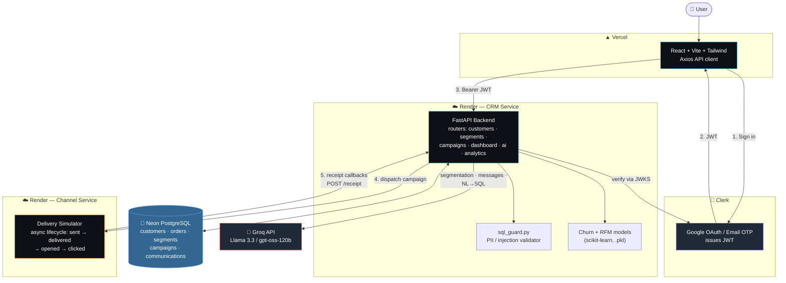
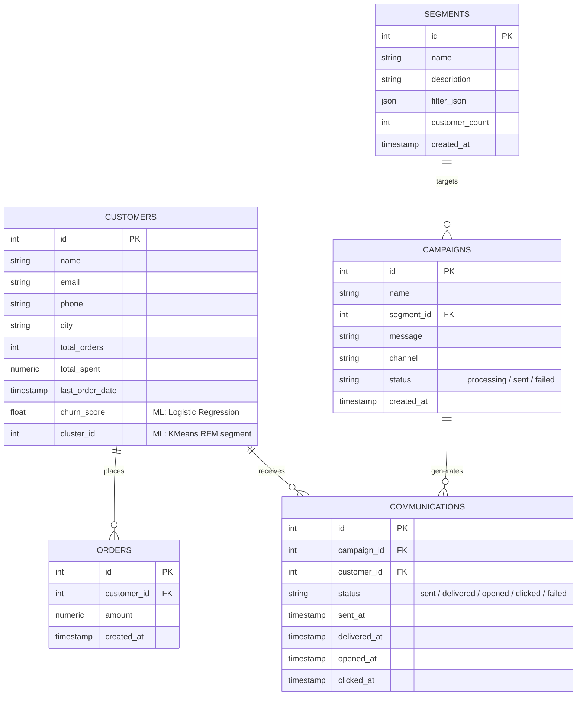
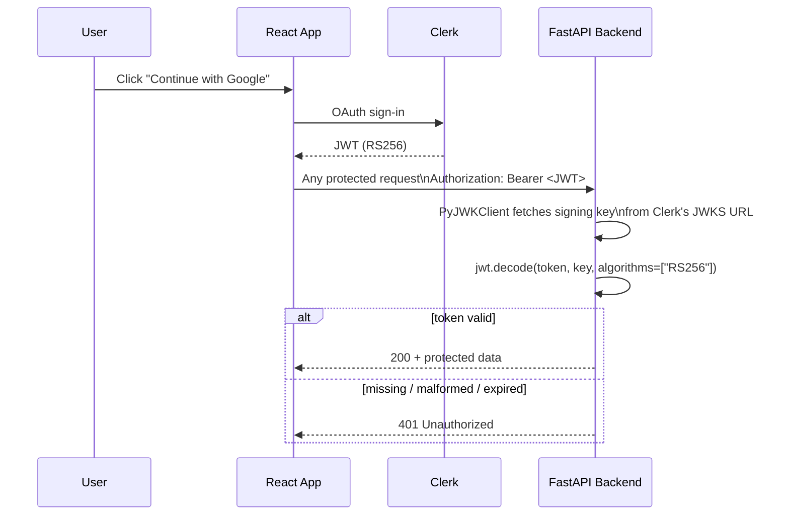
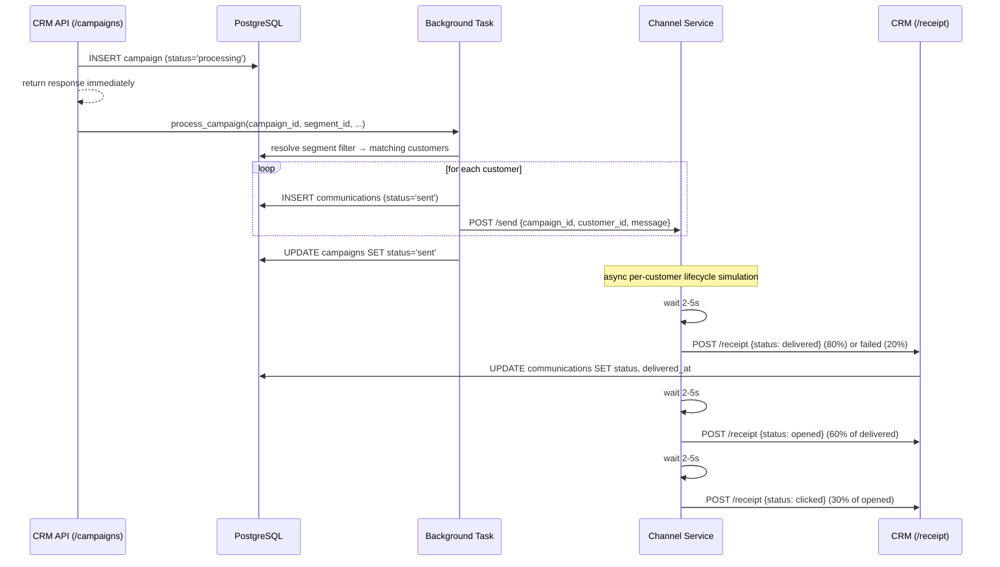
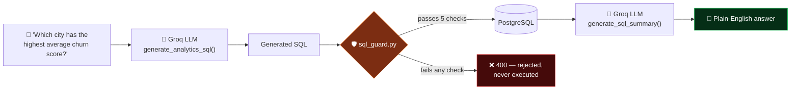
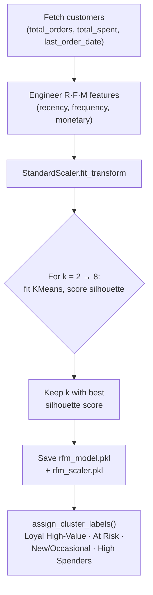
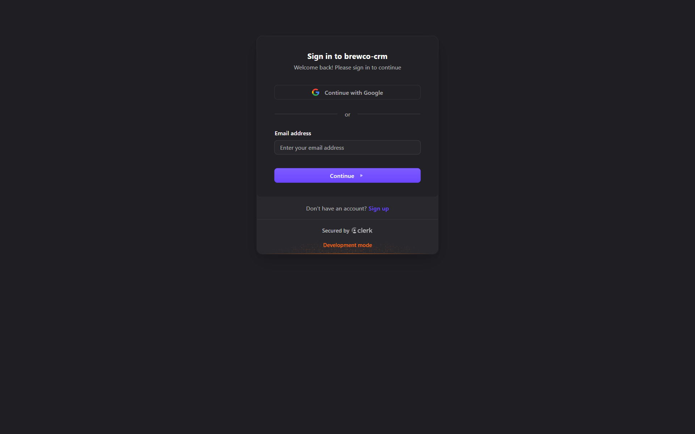
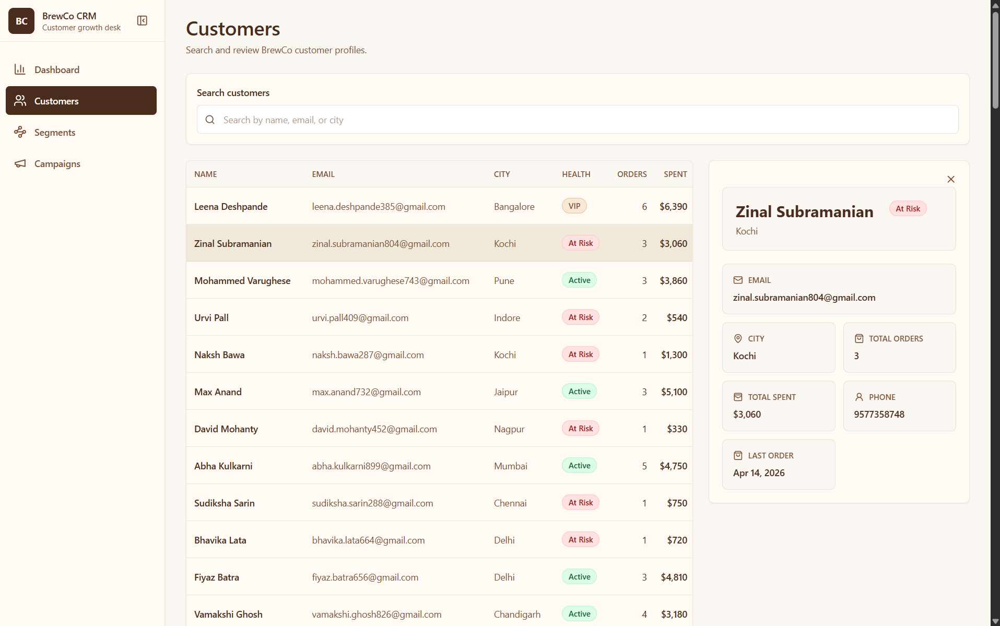
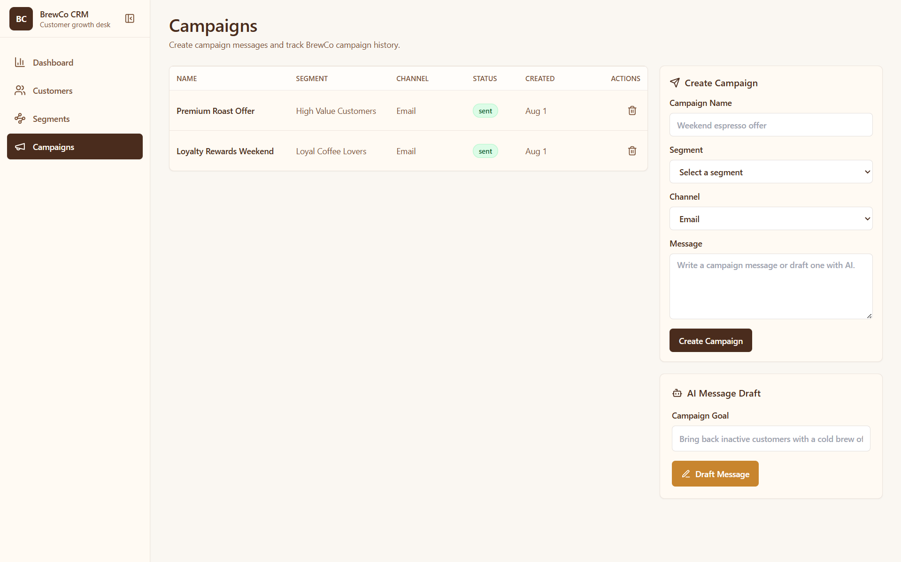

<div align="center">

# ☕ BrewCo CRM

### An AI-powered, microservice-backed CRM platform — customer segmentation, churn prediction, RFM clustering, natural-language analytics, and AI-assisted campaigns, all behind JWT-secured REST APIs.


**2 microservices · 1 ML-scored customer table · 2 trained models · 12+ REST endpoints · adversarially-tested SQL guard**

</div>

---

## 🚀 Live Demo

| Service | URL |
|---|---|
| Frontend | https://brewco-crm-pi.vercel.app |
| Backend API | https://brewco-crm-backend-7xrd.onrender.com |

💡 **Authentication:** Use *Continue with Google* for instant access — no email verification required.

---

## 📖 Table of Contents

- [Overview](#-overview)
- [Architecture](#-architecture)
- [Data Model](#-data-model)
- [Authentication Flow](#-authentication-flow)
- [Campaign Delivery Pipeline](#-campaign-delivery-pipeline)
- [Ask Your Data — NL-to-SQL Pipeline](#-ask-your-data--nl-to-sql-pipeline)
- [Machine Learning Layer](#-machine-learning-layer)
- [Security Hardening: Two Real Bypasses Found and Fixed](#-security-hardening-two-real-bypasses-found-and-fixed)
- [Tech Stack](#-tech-stack)
- [Features](#-features)
- [API Endpoints](#-api-endpoints)
- [Project Structure](#-project-structure)
- [Local Setup](#️-local-setup)
- [Known Limitations](#-known-limitations)
- [Screenshots](#-screenshots)

---

## 🧭 Overview

BrewCo CRM is a full-stack customer relationship management platform built for a fictional coffee brand — but engineered the way a real production CRM would be: a **decoupled delivery microservice** instead of sending messages inline, an **ML scoring layer** that runs independently of the request path, an **LLM-to-SQL pipeline with a hand-built safety guard** rather than trusting model output blindly, and **JWT verification against a live JWKS endpoint** rather than a shared secret.

At its core it answers three questions a coffee brand actually has:
- *Who are my customers, really?* → RFM clustering discovers behavioral segments automatically
- *Who's about to leave?* → a churn model scores every customer from order behavior
- *What does my data say?* → ask a plain-English question, get a validated, SQL-backed answer

---

## 🏗️ Architecture



Two independently-deployed FastAPI services, one shared Postgres database, and an LLM in the loop for three distinct, guarded features — not one monolith pretending to be a platform.

---

## 🗃️ Data Model



`churn_score` and `cluster_id` on `customers` aren't computed at request time — they're written by offline scoring scripts (`update_churn_scores.py`, `update_customer_clusters.py`) so every API read is a cheap column lookup, not a live model inference.

---

## 🔐 Authentication Flow



`/receipt` and `/health` are the only public routes — they're called internally by the channel microservice, not by the browser, so they're deliberately excluded from the JWT check. Every other route depends on `verify_clerk_token`.

---

## 📣 Campaign Delivery Pipeline

Sending a campaign doesn't block the API — it's handed to a **background task** the moment the campaign row is created, and delivery status streams back asynchronously from a separate service.



The channel service models a realistic funnel — not every send is delivered, not every delivery is opened, not every open is clicked — which is exactly what powers the funnel chart on the Campaigns dashboard.

---

## 🔎 Ask Your Data — NL-to-SQL Pipeline



`sql_guard.py` validates every LLM-generated query against **five independent checks** before it ever touches the database: must start with `SELECT`, no semicolons (blocks multi-statement injection), no `INSERT/UPDATE/DELETE/DROP/ALTER/...` keywords, only whitelisted tables (`customers`, `orders`, `segments`, `campaigns`, `communications`), and — the one that took two iterations to get right — no raw exposure of `email`/`phone`. See below.

---

## 🧠 Machine Learning Layer

### Churn Prediction

A **Logistic Regression** model (`C=0.1`, `max_iter=1000`) scores every customer's churn likelihood from four order-derived features: total orders, total spend, days since last order, and average order value. Rather than needing historical "did they actually churn" outcomes (which this dataset has no ground truth for), labels are generated from an explainable **composite risk score**:

```
composite_risk = 0.5 × recency_risk + 0.3 × frequency_risk + 0.2 × monetary_risk
is_churned      = 1 if composite_risk > 0.5 else 0
```

That weighting is a deliberate, inspectable business rule rather than a black box — recency dominates because a customer who hasn't ordered in months is a stronger churn signal than one who orders rarely but recently. Scores refresh via `update_churn_scores.py`, not once at training time.

### RFM Customer Clustering

Customers are grouped into behavioral segments using **KMeans** on standardized Recency, Frequency, and Monetary features. Instead of hardcoding a cluster count, `train_rfm_clusters.py` sweeps **k = 2 through 8**, scores each with **silhouette score**, and keeps whichever k best separates the data — the segment count is *discovered*, not guessed.



Once clusters are assigned, the backend auto-labels each one by its characteristics — highest orders×spend becomes "Loyal High-Value", highest recency becomes "At Risk", lowest order count becomes "New/Occasional" — turning raw cluster IDs into something a marketer can act on without reading the model.

---

## 🔐 Security Hardening: Two Real Bypasses Found and Fixed

Building `sql_guard.py` wasn't a single pass — adversarial testing surfaced two genuine PII-leak vulnerabilities during development, both fixed before shipping:

**1. The `SELECT *` bypass.** The initial PII check searched the generated SQL for the literal words `email`/`phone`. A query like `SELECT * FROM customers` contains neither word, so it passed validation while still returning every column, PII included, once executed.
→ **Fix:** any bare `*` outside `COUNT(*)` is now rejected outright, forcing every query to name columns explicitly.

**2. The aggregate-function bypass.** The next check allowed `email`/`phone` through as long as *some* aggregate function wrapped them — correct for `COUNT(email)` (returns a number, safe) but wrong for `STRING_AGG(email, ', ')` or `ARRAY_AGG(phone)` (return the actual PII values, concatenated). A query asking to "show all customer emails" got past validation and returned real data for all 100 customers.
→ **Fix:** `email`/`phone` are now permitted inside `COUNT()` only — any other aggregate wrapping them is rejected.

Every fix was verified against adversarial test cases (`DROP`/`UPDATE` injection attempts, semicolon-based multi-statement injection, disallowed tables, direct and aggregate-wrapped PII selection) before being considered resolved.

---

## 🐳 Tech Stack

| Layer | Choice |
|---|---|
| **Frontend** | React + Vite + Tailwind CSS, Axios |
| **Backend** | FastAPI (async), `asyncpg` connection pool |
| **Database** | PostgreSQL (Neon, serverless) |
| **Auth** | Clerk — Google OAuth + Email, verified via JWKS/RS256 |
| **AI** | Groq API — Llama 3.3 / `gpt-oss-120b` |
| **ML** | scikit-learn — Logistic Regression (churn), KMeans (RFM) |
| **Microservice** | Independent FastAPI channel-delivery simulator |
| **Deployment** | Vercel (frontend), Render (both backend services), Neon (DB) |

---

## ✨ Features

- **Customer Management** — bulk ingestion, profile management, city distribution insights
- **Order Management** — bulk order ingestion, revenue tracking, order analytics
- **AI Segmentation** — natural-language description → structured filter JSON via Groq
- **Discovered Segments** — auto-labeled RFM clusters, convertible into targetable segments
- **Campaign Management** — create, launch, and track campaigns with live delivery/open/click stats
- **Ask Your Data** — plain-English question → validated SQL → plain-English answer
- **Churn Prediction** — every customer scored by a trained Logistic Regression model
- **Authentication** — Google Sign-In & Email via Clerk, JWT-secured REST APIs throughout
- **Microservice Architecture** — decoupled delivery simulator with async receipt callbacks
- **Uptime Monitoring** — backend kept warm to avoid Render cold starts

---

## 📊 API Endpoints

| Method | Endpoint | Auth | Description |
|---|---|---|---|
| GET | `/customers` | ✅ | List all customers |
| GET | `/segments` | ✅ | List segments |
| POST | `/segments` | ✅ | Create segment from filter JSON |
| GET | `/segments/discovered` | ✅ | List auto-labeled RFM clusters |
| POST | `/segments/discovered/{cluster_id}/convert` | ✅ | Convert a discovered cluster into a segment |
| GET | `/campaigns` | ✅ | List campaigns |
| POST | `/campaigns` | ✅ | Create & launch campaign (async dispatch) |
| DELETE | `/campaigns/{id}` | ✅ | Delete campaign + its communications |
| GET | `/campaigns/{id}/stats` | ✅ | Sent / delivered / opened / clicked / failed counts |
| GET | `/dashboard/stats` | ✅ | Dashboard KPIs |
| GET | `/dashboard/revenue-trend` | ✅ | 30-day revenue chart |
| POST | `/ai/suggest-segment` | ✅ | Natural language → segment filter JSON |
| POST | `/ai/draft-message` | ✅ | Campaign goal → message copy |
| POST | `/analytics/query` | ✅ | Ask Your Data — NL question → guarded SQL → answer |
| POST | `/receipt` | ❌ Public | Delivery status callback (internal) |
| GET | `/health` | ❌ Public | Health check |

---

## 📁 Project Structure

```
brewco-crm/
├── backend/
│   ├── main.py                    # FastAPI app + router registration
│   ├── core/
│   │   ├── auth.py                 # Clerk JWT verification (JWKS/RS256)
│   │   ├── config.py               # Env var loading + required-var checks
│   │   └── database.py             # asyncpg pool + FastAPI lifespan
│   ├── routers/                    # customers, orders, segments, campaigns,
│   │                                #   dashboard, ai, analytics, receipts, root
│   ├── clients/
│   │   ├── ai_client.py            # Groq: segmentation, message drafting, NL→SQL, summary
│   │   └── channel_client.py       # Dispatch to channel microservice
│   ├── services/
│   │   ├── campaign_processor.py   # Resolves segment → customers → background dispatch
│   │   ├── segment_filters.py      # filter_json → parameterized WHERE clause
│   │   └── sql_guard.py            # 5-check SQL validation & PII protection
│   ├── scripts/
│   │   ├── train_churn_model.py
│   │   ├── train_rfm_clusters.py
│   │   ├── update_churn_scores.py
│   │   └── update_customer_clusters.py
│   ├── models/                     # churn_model.pkl, rfm_model.pkl, rfm_scaler.pkl
│   ├── seed.py                     # Seeds 100 customers, 300 orders (Faker, en_IN)
│   └── requirements.txt
│
├── channel-service/
│   ├── main.py                     # Async delivery-lifecycle simulator + receipt callbacks
│   └── requirements.txt
│
├── frontend/
│   ├── src/
│   │   ├── pages/                  # Dashboard, Customers, Segments, Campaigns
│   │   ├── components/             # charts/, common/ (MetricCard, StatusBadge, ...)
│   │   ├── services/                # Axios API clients per resource
│   │   ├── hooks/                   # useCustomers, useCampaigns, useDashboard, ...
│   │   └── layout/                  # AppLayout, Sidebar, PageHeader
│   └── package.json
│
├── Screenshots/
└── README.md
```

---

## ⚙️ Local Setup

### 1. Clone Repository
```bash
git clone https://github.com/Debasish65368/brewco-crm.git
cd brewco-crm
```

### 2. Backend Setup
```bash
cd backend
python -m venv .venv

# Mac/Linux
source .venv/bin/activate
# Windows
.venv\Scripts\activate

pip install -r requirements.txt
uvicorn main:app --reload
```
Backend runs at `http://localhost:8000`. Backend `.env`:
```
DATABASE_URL=
GROQ_API_KEY=
CHANNEL_SERVICE_URL=http://localhost:8001/send
CRM_RECEIPT_URL=http://localhost:8000/receipt
CLERK_JWKS_URL=
CLERK_ISSUER=
```

### 3. Channel Service Setup
```bash
cd ../channel-service
pip install -r requirements.txt
uvicorn main:app --port 8001 --reload
```
Runs at `http://localhost:8001`.

### 4. Seed the Database
```bash
cd ../backend
python seed.py
```
Inserts 100 customers and 300 orders with realistic Indian data (Faker `en_IN`).

### 5. Train / Refresh ML Models *(optional — pretrained artifacts are included)*
```bash
python scripts/train_churn_model.py
python scripts/train_rfm_clusters.py
python scripts/update_churn_scores.py
python scripts/update_customer_clusters.py
```

### 6. Frontend Setup
```bash
cd ../frontend
npm install
npm run dev
```
Runs at `http://localhost:5173`. Frontend `.env`:
```
VITE_API_URL=http://localhost:8000
VITE_CLERK_PUBLISHABLE_KEY=
```

---

## ⚠️ Known Limitations

- **`cluster_id` isn't a stable identity across retrains.** If `train_rfm_clusters.py` is re-run, KMeans cluster numbering can shift — a segment previously converted from "cluster 2" may end up matching a different group of customers after retraining. Documented directly in `routers/segments.py` rather than silently left as a surprise.
- **Churn labels are rule-derived, not ground-truth.** The composite risk score is an explainable proxy in the absence of real churn outcomes — a deliberate trade-off for interpretability over the "correctness" a black-box label source can't actually offer here either.
- **No query caching yet.** `analytics.py` executes generated SQL directly against live tables with a `LIMIT 100` safety net, but there's no result caching — repeated identical "Ask Your Data" questions re-run the full LLM → SQL → DB → LLM round trip each time.

---

## 📸 Screenshots

**Authentication**


**Dashboard**


**Dashboard — Ask Your Data & Analytics**


**Customers**


**Segments**


**Campaigns**


**Campaign Analytics**


---

<div align="center">

Built by **Debasish Kumar** — B.Tech CSE | Full Stack Developer

</div>
